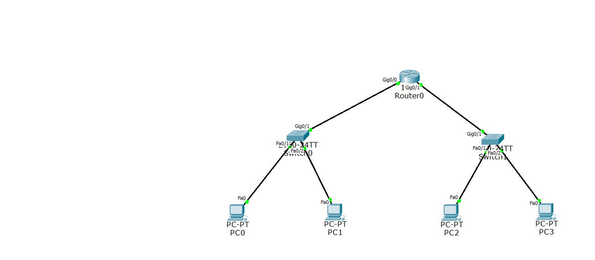

# Basic Network Configuration using Packet Tracer

This project demonstrates a simple network setup using Cisco Packet Tracer with the following components:
- 1 Router
- 1 Switch
- 4 PCs

## Topology

## Steps Performed
1. Configured the router and switch interfaces with the following IPs:
   - Router: 192.168.1.1
   - PC1: 192.168.1.2
   - PC2: 192.168.1.3
   - PC3: 192.168.1.4
   - PC4: 192.168.1.5
     
2. Verified connectivity by sending PDUs (ping) between devices.

## Files
- `basic_network_config.pkt`: Packet Tracer file with the topology.
- `router_config.txt`: CLI configurations for the router and switch.
